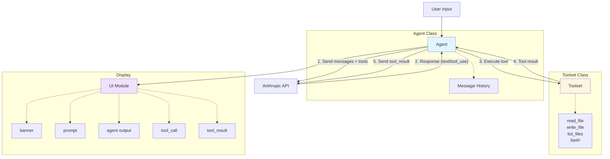

<br>

## Setup

1. Install dependencies:
```bash
bundle install
```

2. Set your API key:
```bash
export ANTHROPIC_API_KEY='your-key-here'
```

<br>

## Running

```bash
ruby agent.rb
```

Type `exit` or press `ctrl-c` to quit.

<br>

## Implementation

The skeleton provides two classes to implement:

### Toolset
Manages tool definitions and execution. Should support:
- `read_file` - read file contents
- `write_file` - write content to file
- `list_files` - list directory contents
- `bash` - execute shell commands

### Agent
Handles conversation loop:
- Accepts user input
- Calls Anthropic Messages API with tool definitions
- Processes tool use requests
- Returns results back to API until completion

<br>

## Architecture



<br>

## Solution

A complete implementation is available on the `solution` branch:
```bash
git checkout solution
```
